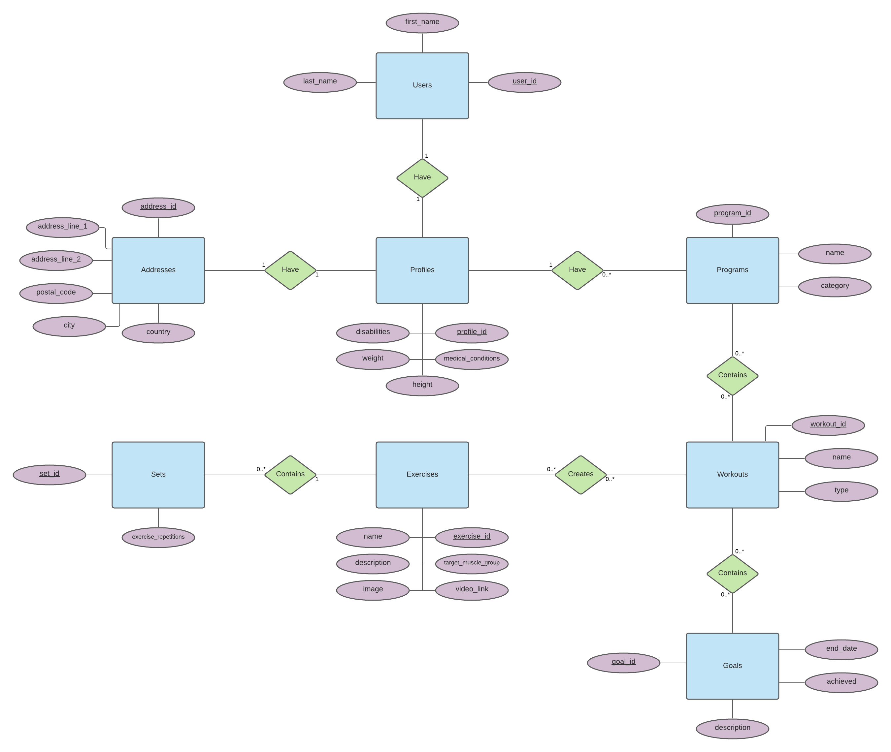
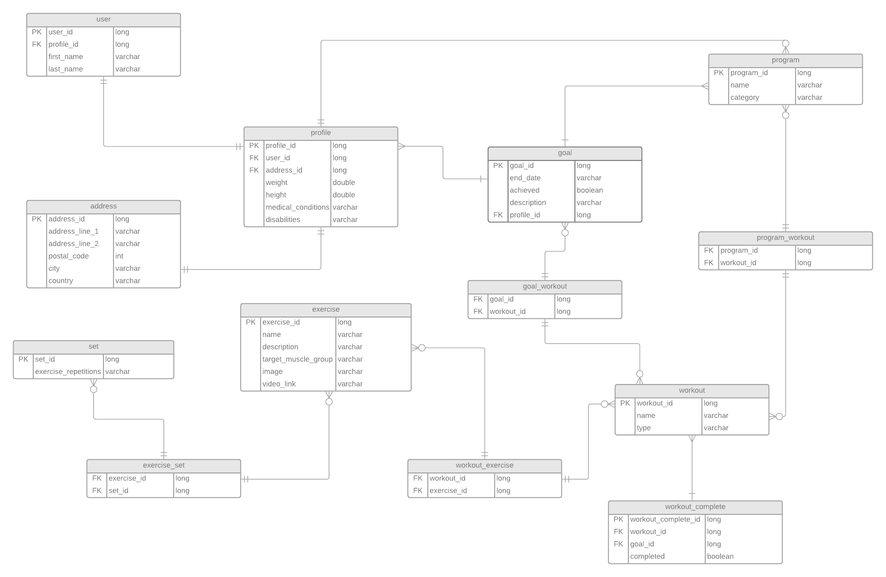
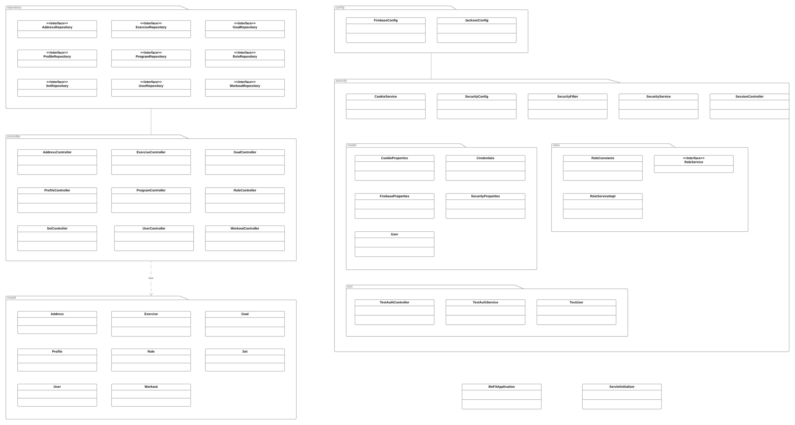
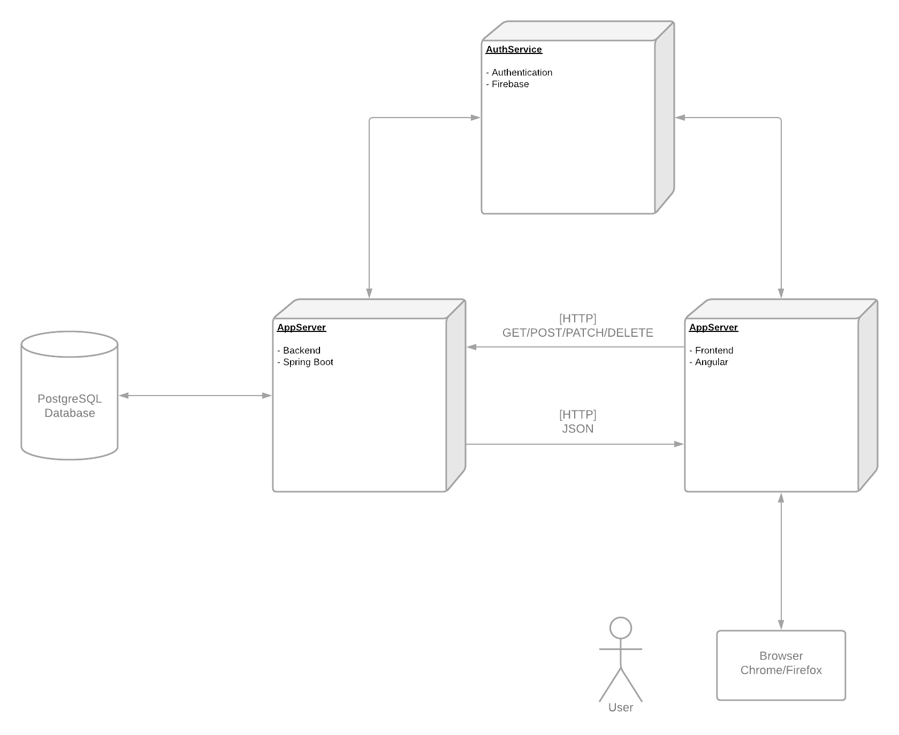

# MeFit

## 1. About

This is an Experis Academy Case. The application, MeFit, is for managing workout goals and to motivate users to complete the exercise regime in weekly goal setting towards consistent relevant exercise.
The application is written in JavaScript and Java with the frameworks Angular and Spring Boot. The relational database used is PostgreSQL.

## 2. Technologies

This fullstack solution is built using:

- Spring Boot
- PostgreSQL
- Angular

## 3. Architecture

The application has a 3-Tier Architecture that consists of a frontend, backend and database
tier.

For the frontend we use the Angular framework. The application has protected routes and bearer tokens are used for authentication and authorization.
Angular is used to manage authentication and user’s state. When requests to the backend are made the bearer tokens are sent as headers for further validation and authorization.

For the backend we use Spring Boot. The backend is a RESTful API that communicates to a PostgreSQL database with Hibernate.
The Spring Boot also consists of Swagger for information regarding how to use the API. 

For more information concerning the architecture of the backend or frontend please refer to the codebase itself found in this repository.

### 3.1 E/R Diagram

### 3.2 Database Schema

### 3.4 Class Diagram

### 3.5 Deployment Diagram

## 4. User Manual

User manual is available in PDF in the root of the repository.

## 5. Screenshots

## 6. Team
Marcus Cvjeticanin - [@mjovanc](https://github.com/mjovanc)
\
Alexander Idemark - [@#](#)
\
Ante Hellgren - [@#](#)
\
Joakim Österberg - [@#](#)

## 7. To start the application locally

1. Start the backend Spring Boot application by open up the directory "spring" inside backend inside IntelliJ or preferred IDE and all dependencies will install automatically by Gradle.

2. Set the environment variable `GOOGLE_APPLICATION_CREDENTIALS` inside IntelliJ to point to the file "firebase.json" that is located in the resource directory so the communication is available to Firebase Authentication.

3. Run the MeFitApplication java file in the root directory of the Java project. It should be listening to port 8080.

4. Install the Angular CLI

5. Install the node dependencies with `npm install`

6. Start the frontend Angular application by navigate to /frontend/angular and run `ng serve` and it should be listening on localhost with port 4200.

